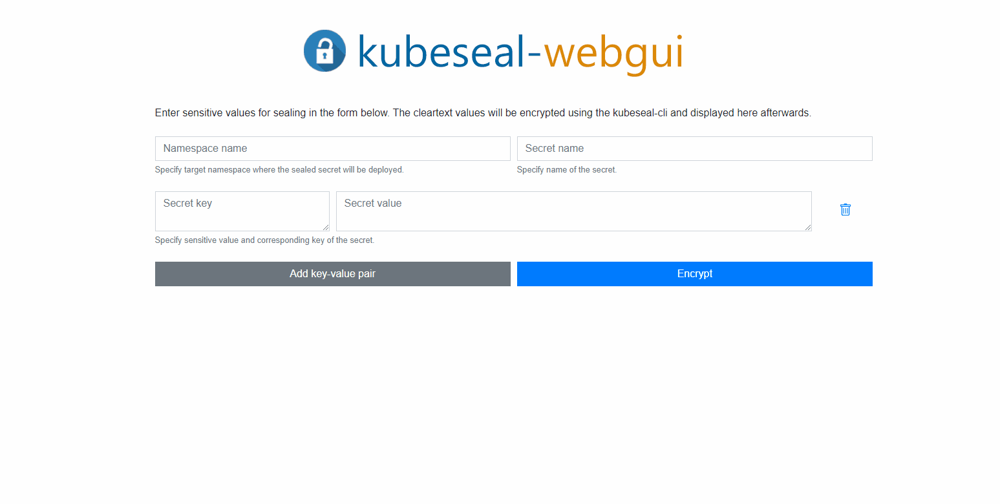

# Web-Gui for Bitnami Sealed-Secrets

    

  

## Description

This is a python based webapp for using Bitnami-Sealed-Secrets in a web-gui.

This app uses the kubeseal binary of the original project: <https://github.com/bitnami-labs/sealed-secrets>
Currently using version `0.16.0` of the kubeseal-binary.

The docker image can be found here: https://hub.docker.com/repository/docker/kubesealwebgui/kubeseal-webgui

## Demo

## Prerequisites

To use this Web-Gui you have to install [Bitnami-Sealed-Secrets](https://github.com/bitnami-labs/sealed-secrets) in your cluster first!

## Usage

Mount the public certificate of your sealed secrets controller to `/kubeseal-webgui/cert/kubeseal-cert.pem` in the Docker container.

Please use the [helm chart](https://github.com/Jaydee94/kubeseal-webgui/tree/master/chart/kubeseal-webgui) which is included in this repository.

## Upgrade from 2.0.X to 2.1.0

When upgrading to `2.1.0` make sure that you also update the helm chart for installing kubeseal-webgui.
The application reads namespaces from current kubernetes cluster and needs to have access to list them.
If your default serviceaccount has this RBAC rule already you could disable `serviceaccount.create` in the `values.yaml` of the helm chart.

### Get Public-Cert from sealed-secrets controller

(Login to your kubernetes cluster first)

`kubeseal --fetch-cert --controller-name <your-sealed-secrets-controller> --controller-namespace <your-sealed-secrets-controller-namespace> > kubeseal-cert.pem`

# Contribute

## Working on the API

Requirements: 

* Make sure you have Python 3.8 installed.

Setup:

* Clone this repository and run `cd api`.
* `python3 -m venv venv` (to create a virtual environment called `venv` that doesn't interfere with other projects)
* `source venv/bin/activate` (to activate the virtual environment)
* `python -m pip install -r requirements.txt` (to install all required packages for this project)
* `pytest` (should run all tests successfully)

## Working on the UI

Setup:

* Clone this repository and run `cd ui`.
* You can either use `yarn` or `npm` for the following commands.
* `yarn install` to install all dependencies 
* `yarn serve` to compile and start HTTP server with hot-reloads for development

...
