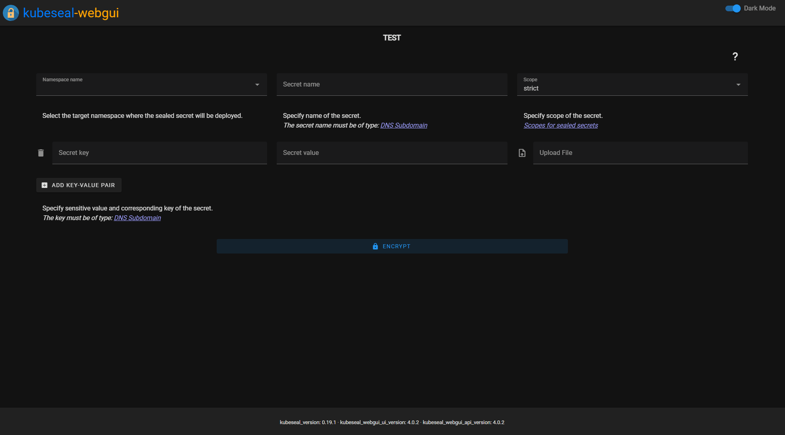

# Web-Gui for Bitnami Sealed-Secrets

[](https://www.python.org/)  [](https://opensource.org/licenses/Apache-2.0) [](https://deepsource.io/gh/Jaydee94/kubeseal-webgui/?ref=repository-badge) [](https://github.com/Jaydee94/kubeseal-webgui/actions/workflows/codeql-analysis.yml)

<p align="center">
  
</p>

## Description

This is a python based webapp for using Bitnami-Sealed-Secrets in a web-gui.

This app uses the kubeseal binary of the original project: <https://github.com/bitnami-labs/sealed-secrets>

Currently using version `0.20.2` of the kubeseal-binary.

The docker images can be found here:

* https://hub.docker.com/repository/docker/kubesealwebgui/ui
* https://hub.docker.com/repository/docker/kubesealwebgui/api

## Demo



## Prerequisites

To use this Web-Gui you have to install [Bitnami-Sealed-Secrets](https://github.com/bitnami-labs/sealed-secrets) in your cluster first!

## Installation

You can use the helm chart which is included inside this repository to install kubseal-webgui.

```bash
helm repo add kubesealwebgui https://jaydee94.github.io/kubeseal-webgui/
helm repo update

# Make sure to configure all required values (with helm's --set argument) documented in our helm Chart before installing.
helm install kubesealwebgui/kubeseal-webgui --set example_required_value="foobar"
```

## Usage

Mount the public certificate of your sealed secrets controller to `/kubeseal-webgui/cert/kubeseal-cert.pem` in the container.

Please use the [helm chart](https://github.com/Jaydee94/kubeseal-webgui/tree/master/chart/kubeseal-webgui) which is included in this repository.

## Upgrade from 2.0.X to 2.1.0

When upgrading to `2.1.0` make sure that you also update the helm chart for installing kubeseal-webgui.
The application reads namespaces from current kubernetes cluster and needs to have access to list them.
If your default serviceaccount has this RBAC rule already you could disable `serviceaccount.create` in the `values.yaml` of the helm chart.

## Upgrade from 2.0.X to 3.0.X

When upgrading to `3.0.X` you dont need to deploy a ingress route to the api. The nginx serving the ui will proxy the requests to the api.
You can use the new helm chart located inside the `chart` folder to deploy the new kubseal-webgui version.

## Upgrade from 4.0.X to 4.1.X

When upgrading from `4.0.X` to `4.1.X` you need to use the provided helm chart in version `>=5.0.0` **if you use the autofetch certificate feature**.
This is because the autofetch certificate functionality is no longer executed as an initContainer.
The api container will fetch the certificate from the sealed-secrets controller on application startup.

### Get Public-Cert from sealed-secrets controller

(Login to your kubernetes cluster first)

`kubeseal --fetch-cert --controller-name <your-sealed-secrets-controller> --controller-namespace <your-sealed-secrets-controller-namespace> > kubeseal-cert.pem`

# Contribute

## Working on the API

### Requirements

* Make sure you have Python 3.10 installed.

#### Setup API

* Clone this repository and run `cd api`.
* `python3 -m venv venv` (to create a virtual environment called `venv` that doesn't interfere with other projects)
* `source venv/bin/activate` (to activate the virtual environment)
* `python -m pip install .` (to install all required packages for this project)
* `pytest` (should run all tests successfully)

### Local API testing

* Running uvicorn server

  ```bash
  MOCK_ENABLED=true poetry run uvicorn kubeseal_webgui_api.app:app --port 5000 --log-config config/logging_config.yaml
  ```

  or use a container and set the environment variables there

  ```bash
  docker build -t api -f Dockerfile.api .
  docker run --rm -t \
   -p 5000:5000 \
   -e MOCK_ENABLED=TRUE \
   -e KUBESEAL_CERT=/tmp/cert.pem \
   api
  ```

## Working on the UI

### Setup UI

* Clone this repository and run `cd ui`.
* You can either use `yarn` or `npm` for the following commands.
* `yarn install` to install all dependencies
* `npm install` to install all dependencies

### Local UI testing

* `yarn serve` to compile and start HTTP server on `port 8080` with hot-reloads for development
* `npm run serve` to compile and start HTTP server on `port 8080` with hot-reloads for development
