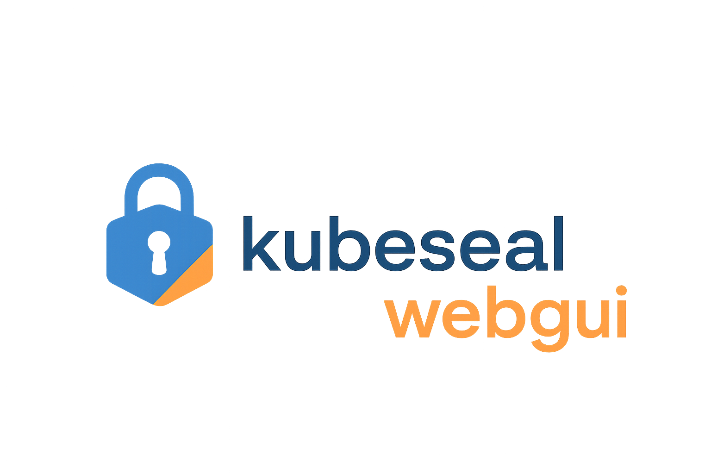
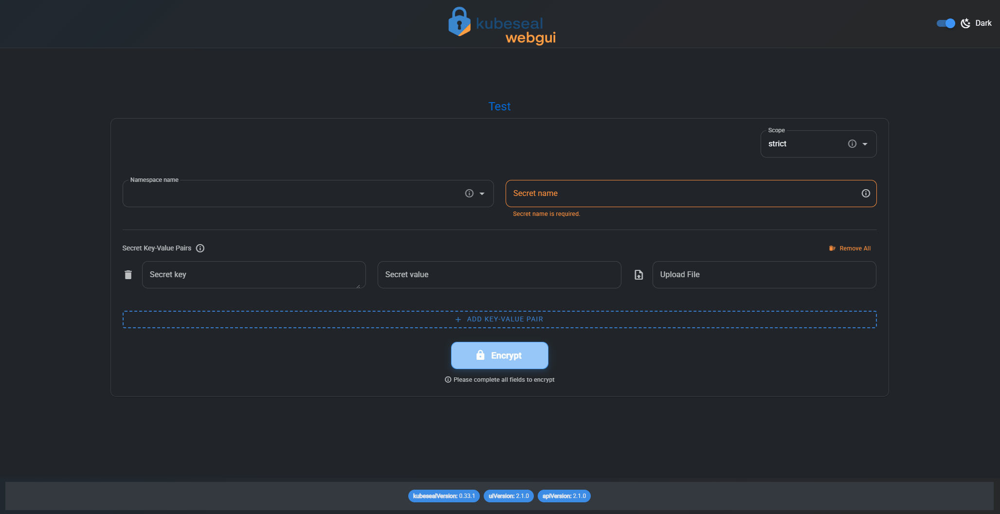

# kubeseal-webgui

[](https://opensource.org/licenses/Apache-2.0)
[](https://github.com/Jaydee94/kubeseal-webgui/actions/workflows/codeql-analysis.yml)
[](https://github.com/Jaydee94/kubeseal-webgui/releases)

<p align="center">
  
</p>

kubeseal-webgui is a web frontend for
[Bitnami Sealed Secrets](https://github.com/bitnami-labs/sealed-secrets). It
lets cluster operators encrypt Kubernetes Secrets in the browser using the
cluster's public certificate, without exposing the `kubeseal` CLI to every
user. The backend is FastAPI (Python 3.12), the frontend is Vue 3 + Vuetify 4,
and the app ships as two container images plus a Helm chart on the GitHub
Container Registry.

## Demo



## Prerequisites

- A Kubernetes cluster (1.25 or newer).
- The [Bitnami Sealed Secrets controller](https://github.com/bitnami-labs/sealed-secrets)
  already installed in the cluster.
- [Helm 3.8 or newer](https://helm.sh/docs/intro/install/).

## Quickstart

```bash
helm install kubeseal-webgui \
  oci://ghcr.io/jaydee94/kubeseal-webgui/charts/kubeseal-webgui \
  --namespace kubeseal-webgui \
  --create-namespace
```

See [docs/installation.md](docs/installation.md) for ingress, OpenShift route,
and certificate options.

## Documentation

- [Installation](docs/installation.md) — Helm install, ingress, OpenShift route,
  certificate setup.
- [Configuration](docs/configuration.md) — full Helm values reference and API
  environment variables.
- [Architecture](docs/architecture.md) — how the UI, API, and kubeseal binary
  fit together; API endpoints; RBAC.
- [Development](docs/development.md) — local setup for the API and UI, running
  tests, building images, end-to-end testing with KinD.
- [Troubleshooting](docs/troubleshooting.md) — common errors and how to fix
  them.
- [Helm chart README](chart/kubeseal-webgui/README.md) — chart-specific TL;DR.
- [Security policy](SECURITY.md) — supported versions and how to report a
  vulnerability.
- [Release history and upgrade notes](https://github.com/Jaydee94/kubeseal-webgui/releases) —
  every version is documented as a GitHub Release.

## Contributing

Contributions are welcome. See [CONTRIBUTING.md](CONTRIBUTING.md) for the
workflow (Conventional Commits drive the release process) and
[docs/development.md](docs/development.md) for local setup.

## License

Apache 2.0. See [LICENSE](LICENSE) and [NOTICE](NOTICE).
